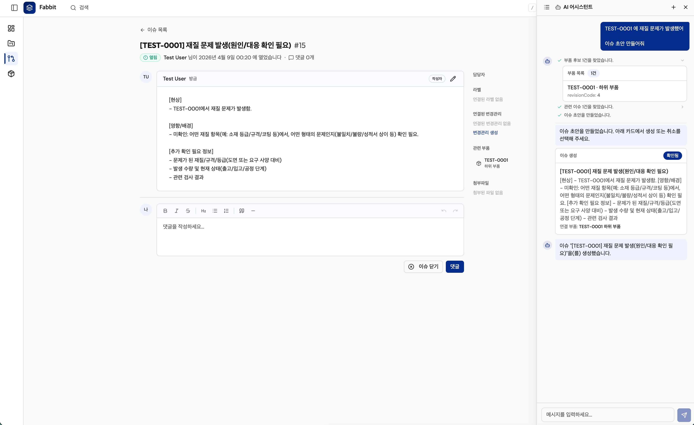
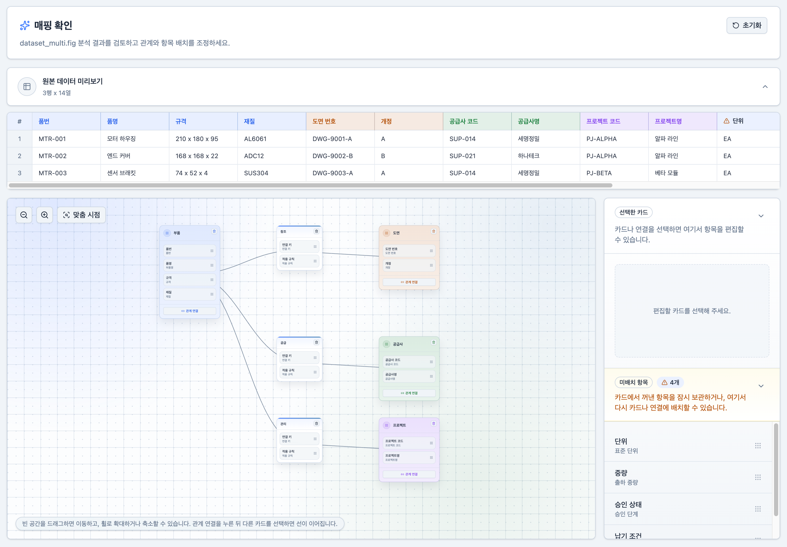

# Fabbit — 제조업 PLM/MES SaaS 플랫폼

## 프로젝트 개요

| 항목      | 내용                                                                            |
| --------- | ------------------------------------------------------------------------------- |
| 기간      | 2026.02 ~ 2026.04 (약 3개월)                                                    |
| 인원      | 1인 (기획, 백엔드, 프론트엔드, 인프라, 데스크탑 클라이언트)                     |
| 배경      | 코너스톤테크놀러지(제조업 PLM 솔루션)에서의 도메인 경험을 기반으로 한 창업 시도 |
| 상태      | 프로덕션 출시 목표로 개발 후 해산으로 폐기, 포트폴리오로 공개                   |
| 서버 규모 | OpenAPI Path 118개, Operation 150개, Schema 212개                               |

중소 제조업체의 도면 최신본 관리, 리비전 추적, 설계변경 이력 관리 문제를 해결하는 B2B SaaS입니다.
고객 인터뷰(6건)를 통해 실제 pain point를 검증하고, 제품 방향을 `AI 기반 자동화` → `도면/설계변경 관리 플랫폼`으로 재정의한 뒤 개발을 진행했습니다.

---

## 시스템 구성

```
┌─────────────────────────────────────────────────────────────────────┐
│                          fabbit.app  (브라우저)                       │
│                    React 19 · Turborepo 모노레포                      │
└─────────────────────────────┬───────────────────────────────────────┘
                              │  REST + SSE
┌─────────────────────────────▼───────────────────────────────────────┐
│                      api.fabbit.app  (백엔드)                         │
│       Spring Boot 4 · Java 21 · DDD · 멀티테넌트 · Spring AI           │
│                                                                     │
│  PostgreSQL (테넌트별 스키마)  ·  S3  ·  OpenAI 호환 LLM                 │
└───────────┬──────────────────────────────────┬──────────────────────┘
            │                                  │
┌───────────▼───────────────┐     ┌────────────▼───────────────────┐
│   Tauri 2 · Rust          │     │   OpenTofu · AWS · Cloudflare  │
│   데스크탑 동기화 클라이언트     │     │   CDN, DNS, 스토리지 IaC         │
└───────────────────────────┘     └────────────────────────────────┘
```

---

## 기술적 하이라이트

### 1. FastAPI → Spring Boot 마이그레이션과 하네스 엔지니어링

**문제:** AI 코딩 에이전트(Claude Code)와 협업하여 FastAPI로 개발을 시작했으나, 코드가 1만줄을 넘으면서 컨벤션 이탈이 발생했습니다. AI용 스킬(규칙)을 정의하고 linter/hook을 구성했지만, 3만줄을 넘어서자 linter를 우회하는 패턴, 로직 분산, 버그가 반복되었습니다.

**판단:** AI 에이전트에게 규칙을 "알려주는" 수준(Context)으로는 한계가 있으며, 규칙을 **"어기면 시스템이 잡아주는"** 수준(Harness)이 필요하다고 판단했습니다. Spring Boot의 타입 시스템과 프레임워크 강제력을 활용하기로 결정했습니다.

**결과:** Spring Boot 마이그레이션 후 ArchUnit으로 아키텍처 테스트를 구축했습니다. AI가 생성한 코드가 레이어 규칙을 위반하면 테스트가 실패하여 빌드가 차단됩니다. 파일 수와 코드량은 늘었지만 Rich Domain Model과 서비스 패턴이 안정적으로 유지되고 있습니다.

```
ArchUnit 가드레일 예시:
- 컨트롤러에서 JPA Entity 타입 노출 금지
- 서비스 간 직접 호출 시 *Api/*Policy 인터페이스 경유 필수
- 이벤트 핸들러에서 타 도메인 유스케이스 직접 호출 금지
- 모든 엔티티에 퍼블릭 세터 금지
```

### 2. 스키마 기반 멀티테넌시

**문제:** 제조업 SaaS는 고객사별 도면, BOM, AI 사용량, 구독 데이터가 완전히 분리되어야 합니다. `WHERE tenant_id = ?` 패턴은 조건 누락 시 데이터가 유출될 수 있고, 나중에 붙이면 기존 쿼리를 전수 검토해야 합니다.

**판단:** 초기부터 PostgreSQL 스키마 분리 방식으로 설계하여 구조적으로 데이터 유출을 차단하기로 했습니다.

**결과:** 요청마다 JWT 클레임에서 조직을 추출하고 `SET search_path`로 스키마를 전환합니다. 조직 생성 시 스키마 생성 → Liquibase 마이그레이션 → 기본값 초기화 → Apache AGE 그래프 준비까지 자동 프로비저닝됩니다. 프로비저닝 실패 시 그래프와 스키마 정리(cleanup)까지 포함한 복구 경로도 구성했습니다.

### 3. CAD 처리 파이프라인 (Java + Python + C++)

**문제:** 제조업 도면 파일(DXF, STEP, IGES)은 산업 특수 포맷이며, 각 포맷의 사실상 표준 파서가 서로 다른 언어(Python, C++)로 작성되어 있습니다. Java로 재구현하는 것은 현실적이지 않습니다.

**판단:** 각 파서를 서브프로세스로 호출하되, 단일 Java 프로세스에서 파이프라인을 조율하는 구조를 설계했습니다.

**결과:**

```
DXF/DWG  → Python (ezdxf)         → PDF → WebP 썸네일
STEP/IGES → C++ (Mayo/OpenCascade) → GLB + 썸네일
PDF       → Java (PDFBox)          → WebP 썸네일
```

Docker 멀티스테이지 빌드에서 Mayo를 소스 컴파일하고, `DrawingPipelineDeadlineContext`로 서브프로세스에 하드 타임아웃을 적용하여 느린 변환이 스레드 풀을 점유하지 않도록 했습니다.

### 4. AI 통합 — 툴 콜링, 도면 매핑 파이프라인, 과금 미터링

단순히 "AI를 붙여본" 수준이 아니라, SaaS 운영 관점까지 설계한 AI 통합입니다.

**Spring AI 툴 콜링:**
AI 어시스턴트가 부품 조회, 이슈 검색, 이슈 초안 생성을 직접 수행합니다. 사용자가 채팅으로 요청하면 AI가 도메인 API를 호출하고, SSE로 토큰 단위 실시간 스트리밍 응답을 반환합니다.



```
ChatController (SSE 엔드포인트)
  → ChatAgentService
    → Spring AI ChatClient
        툴: PartLookupTool        — 부품 조회
             PartIssueLookupTool  — 관련 이슈 검색
             IssueCreateDraftTool — 대화에서 이슈 초안 생성
    → ChatSsePublisher → 클라이언트로 토큰 스트리밍
```

**BOM 엑셀 매핑 파이프라인:**
고객사마다 BOM 엑셀 양식이 다른 것이 진입장벽이었습니다. LLM이 엑셀 헤더를 분석하여 시스템 필드에 1차 매핑을 제안하고, 사용자가 결과를 확인한 뒤 수락하거나 자유롭게 커스터마이징할 수 있도록 설계했습니다. LLM 결과를 100% 신뢰하지 않고 사용자 확인을 거치는 Human-in-the-Loop 구조입니다.



**조직별 토큰 사용량 미터링:**
Micrometer `ObservationHandler`로 AI API 호출마다 토큰 사용량을 캡처하고, 조직/사용자/플랜/좌석 타입 스냅샷과 함께 영속화합니다. 이를 통해 조직별 비용 추적과 플랜별 사용량 제한이 가능합니다.

---

## 레포지토리

| 레포                                                                    | 설명                       | 기술                                             |
| ----------------------------------------------------------------------- | -------------------------- | ------------------------------------------------ |
| [**fabbit-server**](https://github.com/fabbitinc/fabbit-server)         | 백엔드 API                 | Java 21 · Spring Boot 4 · PostgreSQL · Spring AI |
| [**fabbit-infra**](https://github.com/fabbitinc/fabbit-infra)           | 인프라 코드                | OpenTofu · AWS · Cloudflare · GitHub OIDC        |
| [**fabbit-file-agent**](https://github.com/fabbitinc/fabbit-file-agent) | 데스크탑 동기화 클라이언트 | Tauri 2.0 · Rust · OAuth 2.0 PKCE                |
| [**fabbit-web**](https://github.com/fabbitinc/fabbit-web)               | 프론트엔드 SPA             | React 19 · TypeScript · Turborepo                |

> 각 레포의 README에서 아키텍처 상세, 설계 결정, 실행 방법을 확인할 수 있습니다.
